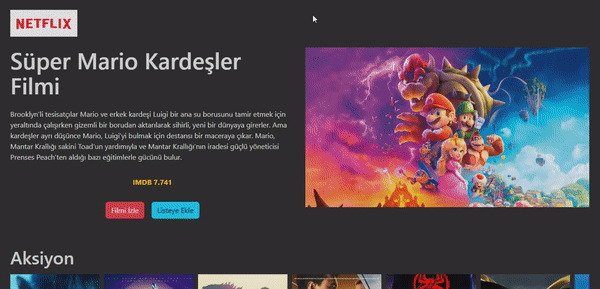

<h1>Netfilix-Clone</h1>

- State Yöenetimi için Redux Thunk kullanıldı
- API'den Kategorisine göre filmler çekildi (axios)
- Sayfalama Yapısı için React-Router-Dom kullanıldı
- Components yapısı oluşturuldu
- Kullanıcı dostu responsive yapıya sahptir

# Kullanılan Kütüphaneler

- react-router-dom
- @splidejs/react-splide
- axios
- redux
- redux-thunk
- react-redux

<h2>Ekran Görüntüsü</h2>

